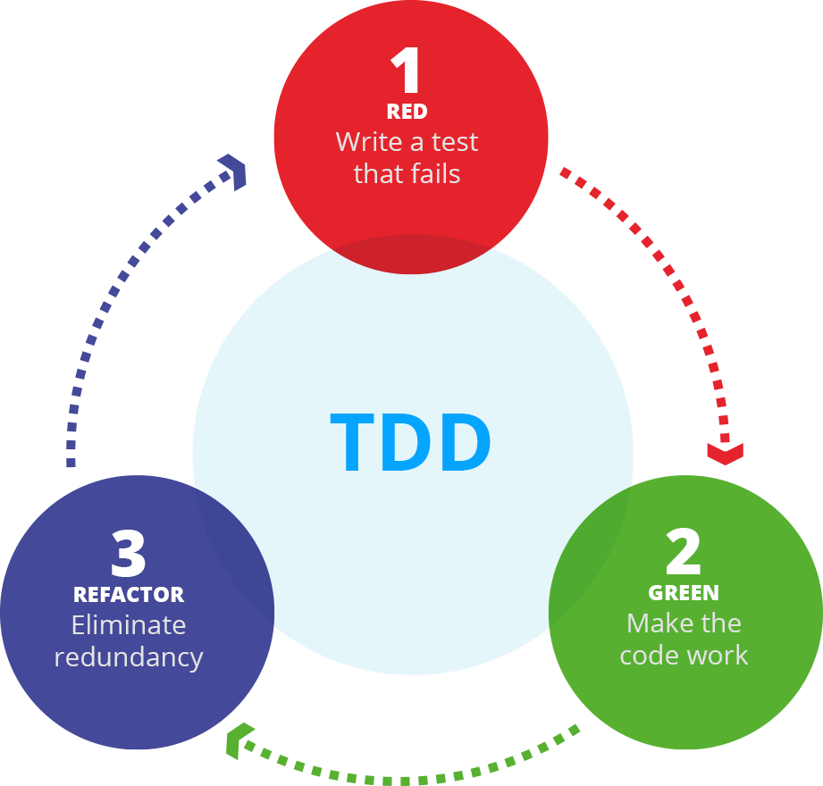

# Python Packaging, Unit Testing and Integration Testing

This repository contains notebook-based modules and Python files covering:

- Python modules and packages,
- unit testing with `pytest`,
- testing data workflows,
- integration testing across file and database boundaries,
- and decorators for reusable validation logic.

## Test-Driven Development (TDD) Workflow



## Module Layout

Each module lives in its own self-contained folder with the notebook, related `src/` files, tests, and any module-specific data.

1. [01-intro-to-python-packaging/01-intro-to-python-packaging.ipynb](01-intro-to-python-packaging/01-intro-to-python-packaging.ipynb): packaging fundamentals and source-layout imports.
2. [02-intro-to-unit-testing/02-intro-to-unit-testing.ipynb](02-intro-to-unit-testing/02-intro-to-unit-testing.ipynb): core `pytest` patterns and small implementation targets.
3. [03-testing-in-data-science/03-testing-in-data-science.ipynb](03-testing-in-data-science/03-testing-in-data-science.ipynb): pandas-oriented checks for imputation and transformations.
4. [04-intro-to-integration-testing/04-intro-to-integration-testing.ipynb](04-intro-to-integration-testing/04-intro-to-integration-testing.ipynb): integration checks across file and SQLite workflows.
5. [05-intro-to-decorators/05-intro-to-decorators.ipynb](05-intro-to-decorators/05-intro-to-decorators.ipynb): closures, decorators, and a parameterized decorator target.

## Expected State From Scratch

After creating the virtual environment and installing dependencies, the repository is expected to behave like this before any implementation targets are completed:

| Module | Expected initial state |
| --- | --- |
| [01-intro-to-python-packaging](01-intro-to-python-packaging) | The primary `add_one()` validation fails until `src/example/example_file.py` is implemented. |
| [02-intro-to-unit-testing](02-intro-to-unit-testing) | [tests/test_division.py](02-intro-to-unit-testing/tests/test_division.py) passes; palindrome and email checks fail; reference checks pass. |
| [03-testing-in-data-science](03-testing-in-data-science) | Imputation checks pass; transformation checks fail. |
| [04-intro-to-integration-testing](04-intro-to-integration-testing) | Both integration-test modules fail until the pipeline methods are implemented. |
| [05-intro-to-decorators](05-intro-to-decorators) | [tests/test_type_check.py](05-intro-to-decorators/tests/test_type_check.py) fails; [tests/test_type_check_solution.py](05-intro-to-decorators/tests/test_type_check_solution.py) passes. |

## Validation Workflow

Create and activate the repository virtual environment once from the repo root:

```bash
source .venv/bin/activate
```

Then run validation commands from inside the module folder you are working on. The notebooks and source-file TODO blocks use explicit interpreter paths so the commands behave the same way without relying on shell activation.

Example:

```bash
cd 02-intro-to-unit-testing
../.venv/bin/python -m pytest -q tests/test_division.py
```

These commands assume your current working directory is the module folder, because imports are resolved from that module layout.

Running `pytest -q tests` inside a module that contains incomplete implementation targets will fail until those targets are completed. Use the module notebook to see which checks are expected to pass immediately and which ones are expected to fail at the start.

## Python Files In This Repo

Most files under `src/` are Python modules that are imported by notebooks and tests. In this repository, you will usually validate those files by importing from them or by running tests against them, not by calling `python some_file.py` directly.

Example from `01-intro-to-python-packaging/`:

```bash
cd 01-intro-to-python-packaging
../.venv/bin/python -c "from src.example.example_file import add_one; print(add_one(3))"
```

That command proves the import path works and shows the function's current output.

The validation command for the same module is:

```bash
cd 01-intro-to-python-packaging
../.venv/bin/python -c "from src.example.example_file import add_one; assert add_one(3) == 4"
```

That command is expected to fail until `add_one()` is implemented correctly. Tests work the same way at a larger scale: they import functions and classes, run them, and compare the result with the expected output.

`__init__.py` marks a directory as a Python package so Python can import modules from it with dotted paths such as `src.example.example_file`. In this repository, `__init__.py` is mainly there to make package structure explicit. You generally do not need to edit it for these modules.

## Troubleshooting

- If `python` or `pytest` is not found, create and activate your virtual environment first.
- If notebook imports fail, run the notebook bootstrap cell near the top of the notebook before importing from `src`.
- If you want printed output during tests, add `-s`, for example:
  - `../.venv/bin/python -m pytest -q -s tests/test_type_check.py`

## Mermaid Diagrams

This repository contains Mermaid diagrams. If you want them to render in VS Code, we recommend installing the `Markdown Preview Mermaid Support` extension:

- [Install in VS Code](vscode:extension/bierner.markdown-mermaid)
- [View on Marketplace](https://marketplace.visualstudio.com/items?itemName=bierner.markdown-mermaid)

## Environment

Please make sure you **use this repository as a template** and set up a new virtual environment. You can use the following commands:

### **`macOS`**

```bash
pyenv local 3.11.3
python -m venv .venv
source .venv/bin/activate
python -m pip install --upgrade pip
python -m pip install -r requirements.txt
```

### **`Windows`**

For `PowerShell` CLI:

```PowerShell
pyenv local 3.11.3
python -m venv .venv
.venv\Scripts\Activate.ps1
python -m pip install --upgrade pip
python -m pip install -r requirements.txt
```

For `Git Bash` CLI:

```bash
pyenv local 3.11.3
python -m venv .venv
source .venv/Scripts/activate
python -m pip install --upgrade pip
python -m pip install -r requirements.txt
```

The [requirements.txt](requirements.txt) file contains all libraries and dependencies needed to execute the notebooks.

## Learning Objectives

By the end of this repository, you should be able to:

- Explain how a source-layout package is organized and import modules from `src/`.
- Describe what `__init__.py` does in this repository's package structure.
- Write and run basic unit tests with `pytest`.
- Use parametrization and fixtures to reduce repetition and share setup.
- Validate pandas `Series` and `DataFrame` outputs with the appropriate testing helpers.
- Recognize integration behavior that crosses file and SQLite boundaries and verify it with tests.
- Understand how closures support decorators and implement a simple parameterized decorator.
